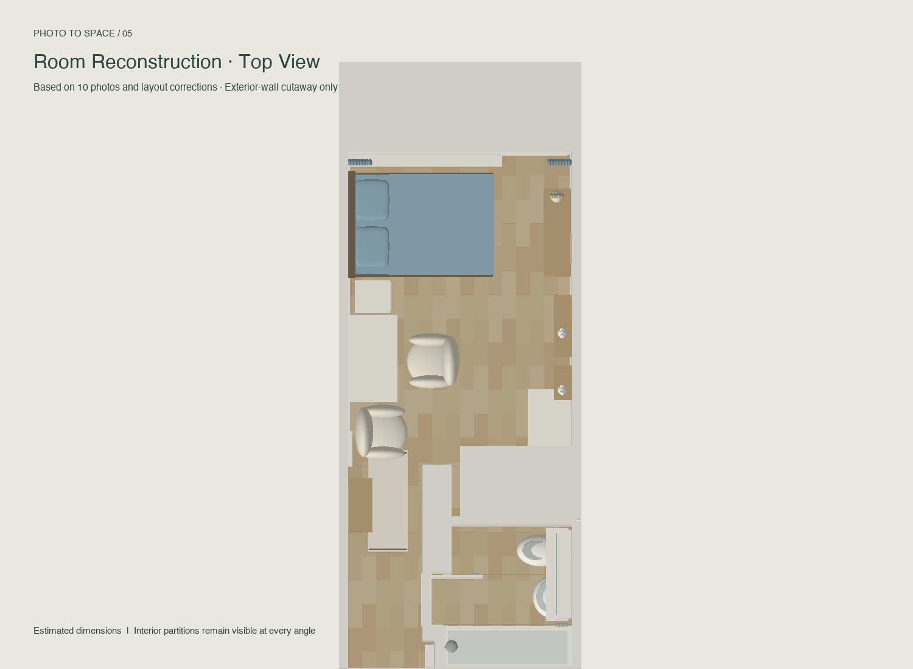
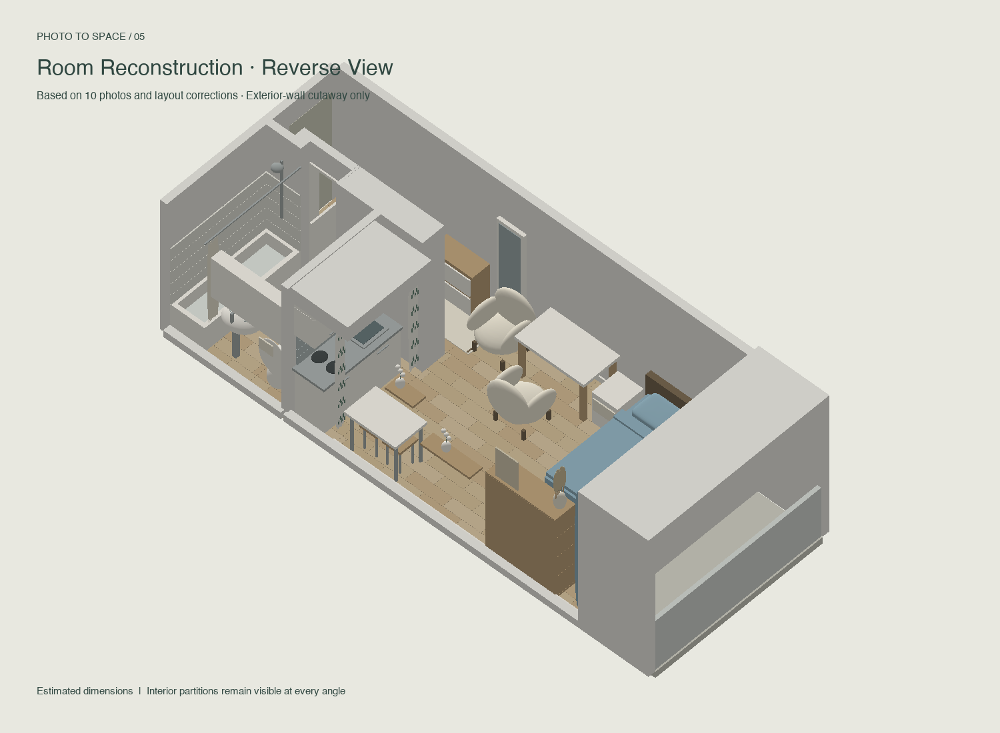

# Room Gaussian Study

**From just ten phone photos to an interactive, decluttered model of my room — built through a Codex-assisted workflow, refined with real-room feedback, and rendered as 3,000,000 Gaussian splats.**

[**Explore the live interactive room →**](https://congyueren.github.io/room-gaussian-study/) · [Mesh viewer](https://congyueren.github.io/room-gaussian-study/room-viewer.html) · [Gaussian viewer](https://congyueren.github.io/room-gaussian-study/gaussian-viewer.html) · [Offline downloads](https://github.com/CongyueRen/room-gaussian-study/releases/latest)


## A simple model of my existing room

This project starts with ordinary photographs taken on a phone, rather than a dedicated scanning setup. I used Codex to create the geometry, viewers and conversion pipeline, then corrected the layout through conversation: the bathroom orientation, built-in wardrobe, wall connections, balcony enclosure and furniture spacing.

The result represents **my room's current, simple layout**. Clothing, bags, boxes and scattered countertop items were omitted while reconstructing it, leaving the furniture and room structure. The source photos were not edited or published. Decluttering here means omission during modeling; this repository does not provide a general-purpose photo-cleanup system.

The creator describes the original workflow as **Codex 5.6**; this repository does not include an independently verifiable model-version log. It includes the generated source so the reconstruction and conversion can be inspected and reproduced.

**This is a mesh-derived Gaussian surface study, not a photo-trained 3DGS scan.** More splats improve sampling coverage; they do not invent photographic texture or recover measurements from the photographs.

## Explore every angle

The following are independent renders of the model, not browser screenshots. The live viewers provide the actual controls described below.

| Overview · Mesh | Entry / Bath |
|:--:|:--:|
|  |  |
| Top view | Reverse view |
|  |  |

### Interactive controls

| Control | What it does |
|---|---|
| Mesh / Gaussian Splats | Switch between conventional geometry and soft Gaussian surface rendering on the demo homepage |
| Drag | Orbit around the room |
| Scroll / pinch | Zoom in and out |
| Overview | Restore the overview camera |
| Top view | Inspect the plan from above |
| Entry / Bath | Focus on the corrected entry and bathroom |
| Reverse | View the model from the opposite side |
| Outer walls: Auto / Show / Hide | Change the visibility of the two long exterior sides; internal partitions and doorway walls stay fixed |
| Show glass / Hide glass (Mesh) | Toggle the window and balcony-door glazing |
| Gaussian count | Select 5–100% of the full dataset: **150,000–3,000,000** points, in 1% steps |
| Splat size | Adjust the Gaussian footprint independently of the selected point count |
| Selected / drawn counts | Compare selected points with those remaining after visibility filtering |
| Mesh view / Gaussian view | Move between the individual viewer pages |
| Download GLB / PLY | Export the mesh or the full three-million-point Gaussian dataset |

The landing page loads Mesh first. The self-contained Gaussian viewer is about **192 MB** before compression and decoding; its first load may take time. On slower devices, reduce Gaussian count. The slider controls a uniform subset of the complete model; it does not remove one region of the room, and PLY downloads always contain all points.

The Mesh viewer also lists the included spaces (bedroom, desk, storage, kitchenette, entry and bathroom) and estimated dimensions: main room **3.2 × 4.5 m**, ceiling **2.56 m**, bed **2.0 × 1.4 m**. The balcony sides reach the same ceiling height.

## Latest model refinements

- Muted gray-blue bedding matched to the curtains, with two rounded rectangular pillows.
- Bathroom order: kitchen → thin shared wall → toilet → basin → bathtub.
- Bathtub flush against its adjoining walls; short return wall matches its width, connects to the doorway, and carries the shower head.
- Tiles on the tub's two adjoining walls; the toilet-side wall is untiled.
- Regular, flush built-in wardrobe directly beside the bathroom entrance.
- Continuous indoor oak flooring, bedside-table clearance, and closer desk/armchair placement.
- Balcony with its original low parapet, two full-height side walls and a roof.
- Sampling progression: **297,320 → 594,640 → 1,189,280 → 3,000,000**.

## Where I want to take this

The current model is a starting point for an interactive interior-design workspace. These capabilities are **planned, not implemented**:

- Train or adapt generative methods to explore different interior styles while preserving room structure.
- Preview alternative soft furnishings and decoration in real time.
- Move furniture and compare arrangements.
- Add or remove furniture and replace individual pieces.
- Save and compare complete furnishing/style scenarios.

## Reproduce the result

Python 3.10+ is required to rebuild; Node.js runs the control-logic checks. Viewing the released HTML files needs no installation.

```sh
python3 -m venv .venv
source .venv/bin/activate
python -m pip install -r requirements.txt
python source/rebuild.py --previews
python source/check_layout.py
node source/check_viewer.js
node source/check_gaussians.js
python source/build_site.py
```

Outputs include `room-clean.glb`, `room-gaussians.ply`, both standalone viewers and a manifest. `source/build_site.py` assembles `work/site/`. GitHub Actions rebuilds the models and deploys that directory to GitHub Pages, keeping large binaries out of Git history. Download and extract the release archive to view offline.

## Validation and limits

Numeric checks cover exactly three million finite samples, normalized rotations, PLY fields, GLB structure, curtain/bedding color agreement, tub/wall/door connections and balcony height. Mock-WebGL checks cover viewpoint controls, count selection, sorting and exterior-only cutaways. Independent renders are visually inspected.

These checks do not establish real-browser GPU performance, shader execution, or compatibility with third-party PLY editors. Dimensions are estimates, not construction measurements. Surface-normal culling, approximate depth sorting and alpha blending can produce soft edges or transparency artifacts. See [the Gaussian guide](docs/gaussian-guide.md) and [progress notes](docs/PROGRESS.md).

## Open source

Released under the [MIT License](LICENSE). Source code, generated room geometry and previews are included; original personal photos are not. Contributions that improve rendering, geometry editing or style experimentation are welcome.
