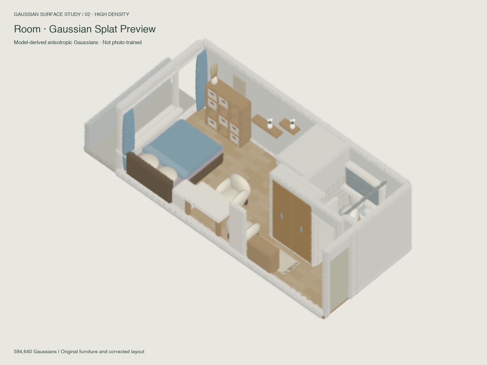
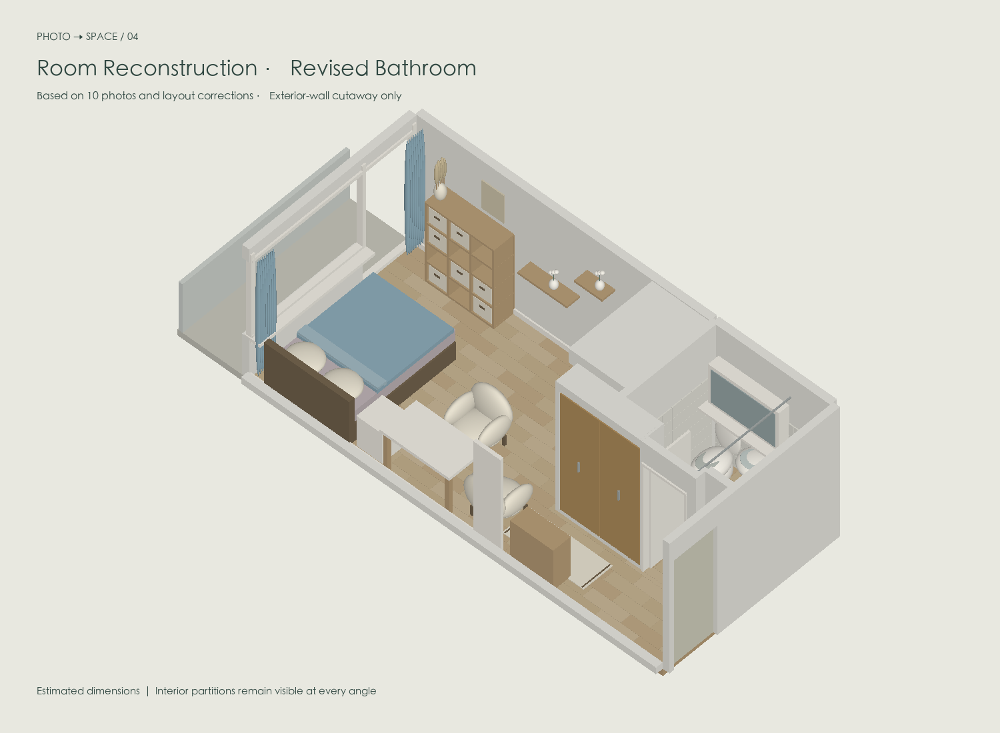
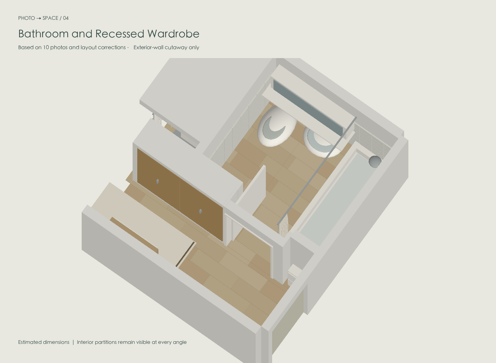

# Room Gaussian Study

**A decluttered room reconstructed from photographs, refined through layout feedback, and converted into 594,640 anisotropic Gaussian splats.**

This is a **model-derived Gaussian surface study**, not a photogrammetric scan or a photo-trained 3DGS reconstruction. The Gaussian version inherits the geometry and colors of the corrected room model.



### Explore the current result

[**Download the ready-to-open project**](https://github.com/CongyueRen/room-gaussian-study/releases/latest) · [Progress and limitations](docs/PROGRESS.md) · [Gaussian format and controls](docs/gaussian-guide.md)

Download and extract the release archive, then open **`gaussian-viewer.html`** in a browser. No installation is required for viewing. Use **Mesh view** to compare the original geometry. The viewers run locally; GitHub's file viewer does not execute HTML.

| Corrected mesh | Bathroom and recessed wardrobe |
|:--:|:--:|
|  |  |

### Current progress

| Milestone | Result |
|---|---|
| Photo-informed reconstruction | Main room, kitchenette, entry, bathroom and balcony assembled from ten reference photos and user corrections |
| Decluttering | Loose clothing, bags, boxes, food containers and countertop clutter omitted |
| Layout refinement | Corrected bathroom orientation; kitchen → shared wall → toilet → basin → tub; recessed wardrobe directly beside bathroom doorway |
| Interior finishes | Continuous indoor oak flooring; enlarged bedside-table space; closer desk/armchair placement |
| Selective wall visibility | Only the two long exterior sides can hide; interior partitions and doorways stay visible |
| Gaussian conversion | Anisotropic surface splats, spherical-harmonic DC color, normalized rotation, log scale and opacity |
| Density upgrade | **297,320 → 594,640 splats (2×)**, with fresh samples and smaller footprints |
| Delivery | English offline viewers, GLB, Gaussian PLY, preview images and editable source |

### Verified—and still approximate

- Verified: primitive counts, doubled sampling per component, finite fields, normalized quaternions, PLY layout, and viewer control/visibility logic.
- Visually inspected: independent renders of both the mesh and Gaussian data.
- **Not yet verified:** real WebGL shader execution and interaction in a browser, third-party PLY import, or performance across devices. JavaScript checks use a mock WebGL context.
- Room dimensions are estimated. The model is not suitable for construction measurement. Increasing splat density does not create photographic detail missing from the mesh.

### Build from source

Requires Python 3.10+; Node.js is needed only for the JavaScript logic checks.

```sh
python3 -m venv .venv
source .venv/bin/activate
python -m pip install -r requirements.txt
python source/rebuild.py
node source/check_viewer.js
node source/check_gaussians.js
```

The build creates `outputs/room-viewer.html`, `outputs/gaussian-viewer.html`, `outputs/room-clean.glb`, and `outputs/room-gaussians.ply`. To regenerate the preview images as well:

```sh
python source/rebuild.py --previews
```

Generated models and self-contained viewers are distributed through **GitHub Releases**, keeping large generated files out of Git history. The repository homepage previews are committed under `docs/images/`.

### Repository layout

```text
source/           Geometry, Gaussian sampler, viewer templates and checks
docs/images/      Current rendered results shown on this homepage
docs/validation/  Snapshot of the high-density model and checks
docs/PROGRESS.md  Project progress, decisions and next steps
outputs/          Generated deliverables (not committed)
work/             Generated intermediate data (not committed)
```

The original photographs, personal filesystem paths, credentials and unrelated thesis files are not included. Repository visibility is private by default. No open-source license is assigned in this initial snapshot.
